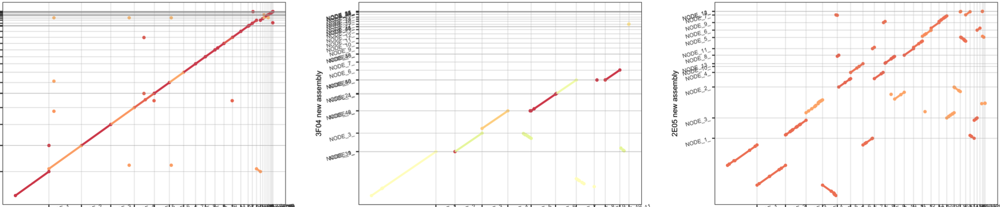

{ width=600px }

# \textcolor{black}{BIO/CSC 243: Bioinformatics}

* Union College, Spring 2026
* Georgia Doing, PhD
* email: doingg@union.edu, 
* office: Steinmetz 108B

#  COURSE BASICS

* Lecture: M/W/F 11:45 am - 12:50 pm
* Location: ISEC 070
* Student/Office Hours: 
	* Monday  	3:00 pm - 4:00 pm
	* Thursday  2:00 pm - 4:00 pm
	* subject to change, check course website for most up-to-date schedule
	* drop-in or schedule a 15 minute slot: 
		<https://calendar.app.google/gnYNtHjwwNxJ2UUN7>
	* by appointment for another time or over zoom

# OVERVIEW

Bioinformatics is the study of how information technology, computer science principles, and algorithmic techniques have affected and informed the study of biology in the 21st century (and vice versa). Specifically, the field of genomics (the study of the function of genes) has generated a tremendous amount of data to be analyzed. Bioinformatics brings to bear data management and analysis techniques found in the information processing field to discover pertinent knowledge in this sea of data that has applications in research and medicine. 

In this course, you will learn about both biological and computer science concepts, how they interact with each other, and how they are used together to further research in genomics. 

## Prerequisites and Course Format

The prerequisite for this course is BIO 205 (Current Topics in Molecular Biology) OR any introductory programming course CSC 10x. Because of this, it is expected that the student population of this course will consist of a mix of Biology and Computer Science students, each student bringing their own knowledge base, skill set, and perspective to the course. Given this diverse population, the first half of the course will concentrate on exposing students from one discipline to the fundamental concepts of the other (and vice versa) in order to gain a working knowledge of the field. Computer Science students will be taught the principles of Molecular Biology, and Biology students will be exposed to the essentials of Computer Science. In the second half of the course, we will assemble teams consisting of both types of students to work on a series of directed projects, the goal of which is to get students to creatively work in the inter- disciplinary fashion that is central to the field of Bioinformatics.

# LEARNING OBJECTIVES

### in Biology:

* basic Mendelian genetics
* the flow of genetic information from DNA to proteins 
* molecular biological approaches and their applications 
* genomic projects and comparative genomics

### in Computer Science:

* algorithm design as a means of problem solving
* basic programming using the Python programming language
* data organization schemes, analysis techniques, and how they apply to biological applications 
* further understanding of what computers can and cannot solve easily

### in Bioinformatics:

* pairwise and multiple alignment matching of gene sequences 
* polymerase chain reaction (PCR) techniques
* automated primer detection phylogenetic trees
* gene prediction
* learn to communicate effectively and work collaboratively in interdisciplinary teams 

# CLASS POLICIES AND GUIDELINES

The Computer Science and Biology Departments, and Union College as a whole, welcome all people, regardless of age, background, beliefs, ethnicity, gender identity, gender expression, national origin, religious affiliation, sexual orientation and any other differences, be they visible or non-visible. It’s also important to recognize that institutional racism has prevented members of marginalized groups - especially black, indigenous and other people of color (BIPOC) - from fully participating in the fields of Computer Science and Biology. 

***You. Yes you, the one reading this syllabus. You belong here.***

As an instructor, I will do my utmost to uphold these principles and to treat everyone with respect. As students in this class, I expect you to do the same since one person is not a community unto themselves. We’re all in this together, so let’s treat each other well. Lastly, I welcome feedback on issues we might discuss or ways that our class can be a more just one for all people.

# COURSE MATERIALS

### Texts (2-3 required)

* Claverie, J. and Notredame, C., *Bioinformatics for Dummies*, 2nd Edition, Wiley Publishing,  2007.
* Downey, A.B., *Think Python: How to Think Like a Computer Scientist*, Green Tea Press. 
	+ This book is free! Read it online at <https://allendowney.github.io/ThinkPython//>
* Kratz, R.F., *Molecular & Cell Biology for Dummies*, 2nd Edition, Wiley Publishing, 2020. 
	+ Only students who have not taken BIO 205 should buy this book.

We’ll use the following websites and software throughout the course:

*	The course website: a github-hosted site with assignments, materials and announcements
	+ <https://georgiadoing.github.io/CSC243-S26/>
	+ you may want to bookmark this to check it before and after each class
*	Gradescope: used to submit programming assignments
	+ <https://www.gradescope.com/courses/1287277>
	+ Entry Code:G6J44N
*	Google Colab: the could-based platform to write and run Jupyter Notebooks with python code
	+ <https://colab.research.google.com/>

# COURSE RESOURCES

The course website has a list and links to the readings and software resources that we are going to use. In class, we are going to use the Linux machines in ISEC 070. Outside of class you have a choice of hardware. You can access Google Colab via a browser on your own machine, install the software on your own computer (Python is freely available for Windows, Mac, and Linux) or you can work in one of the Computer Science labs. We have three spaces that you can use 24/7 using your ID card, except when classes are being held in them:

*	Olin 107 
*	PASTA Lab (ISEC 051+)
*	Computer Science Resource room (Steinmetz Hall, 209A)

For help on your homework and projects, available to your are:

* 	CS Helpdesk (Olin 107, Sun-Thurs 7:00-9:00pm)
*	Biology Backup (ISEC 316, Tues & Thurs 5:30-7:30pm)

# LIBRARY RESOURCES

The library is available to help you with your research needs! Librarians can help you develop research questions, search for and select the best sources for your projects, identify research strategies, evaluate sources, and assist you with creating citations. There are multiple ways for you to contact a librarian. For more information, please see our Ask A Librarian page: <https://www.union.edu/schaffer-library/ask-a-librarian>.

# ACCOMODATIONS 

It is the policy of Union College to make reasonable accommodations for qualified individuals with disabilities. If you are a person with a disability and wish to request accommodations to complete your course requirements, please make an appointment with me or stop by during my office hours as soon as possible, all discussions will remain confidential. You must provide reasonable notice and be in touch with Accomodative Services on the 2nd floor of Schaffer Library, if you have not already, if you wish to take advantage of extra time on exams or quizzes: <https://www.union.edu/accommodative-services>

# GRADING

Some weeks I will give you *homework programming exercises*. You will complete these and submit them online, but they will not contribute to your final grade. Rather, they will prepare you for weekly *in-class quizzes*. There will be 2 *group projects*, and a *final exam*. Finally, class attendance, participation and engagement are critical components of the course. 

*   Particpation & Engagment: 15%
*   Quizzes: 30%
*	Group Projects: 40%
*	Final Exam: 15%

 The final exam is not cumulative.

Programming projects must be turned in electronically via Gradescope. All programs will be done in the Python programming language. CS students will be expected to learn this language on their own during the first five weeks.

**No late submissions will be accepted for any of the group projects. All exams and quizzes are closed-book, closed-notes.**

Letter Grade Scale:

*	A: 93-100; A-: 90-92
*	B+: 87-89; B: 83-86; B-: 80-82
*	C+: 77-79; C: 73-76; C-: 70-72
*	D: 60-69; F: 0-59

# ATTENDANCE

Class participation is a critical component of the course and attendance is mandatory. I realize that sometimes other things come up (interviews, athletic events, illness, emergencies etc.). In those cases, just let me know (in advance, if at all possible) that you are going to be absent. There may not always be the possibility of make-up credit for missed in-class material, but it is more likely for something to be arranged if you discuss your absence with me prior to class. No matter how much class you have missed, please do not come to class if you have an illness that is likley contageous, please email me to work out a reasonable solution.

If you do miss class, it is your responsibility to make up any material that you missed. Get notes from a classmate and make sure to complete all homework assignments due or assigned during the class that you missed. I will expect you to hand in all assignments by their due dates. You will not be able to make up missed exams, quizzes or in-class engagement points without pre-approved exceptions.

# PARTICIPATION AND ENGAGEMENT		

Following these guidelines will constitute postiive participation and engagement and earn you **up to 0.5% of your final grade per activity/assignment**. To demonstrate comprehension of in-class and/or homework assignments and earn relevent engagement points, students will submit written answers for collection and adhere to the follwoing guidelines.  **Falling short of any of the below standards may result in point deductions from any engagement activities relevent to class time(s) during which the student was unengaged**.

* Respect. This course is a space for rigorous and respectful debate. When confronting ideas and people different from you, lead with curiosity rather than judgement. We will critique ideas, not people. To protect our shared learning environment, you may not record, photograph, or share any part of our class sessions outside of our class. 

* Engage. Show up to class on time and prepared. Show up ready to learn by completing the readings and exercises and checking the course website often. Engagement in class constitutes being present, respectful and lending the class your full attention. **It is the student's responsibility to demonstrate this engagement by completing and handing-in thoughtful written responses as directed by in-class prompts and/or homework assignments.** Accessing off-topic websites or software, checking email or phones, *utilizing large language models* or otherwise attending to things not pertinant to the course is distracting to yourself and others and will result in point deductions.

* Embrace intellectual humility. Recognize that there are limitations to your knowledge and that some of your beliefs could be wrong. Be curious about your thinking and open to learning from others. This is hard, but so vital to your learning —we’ll work on developing this throughout the term!

* Get help when you need it. If you are stuck or confused or lost, be proactive and get help. The best learners and thinkers can figure out when they are stuck and make a plan to get unstuck. Come to Office Hours (Steinmetz 108B), the CS Helpdesk (Sun-Thurs 7:00-9:00pm Olin 107) or Biology Backup (ISEC 316, Tues & Thurs 5:30-7:30pm). Try reaching out to another student in the course who seems like they get it—they will probably be flattered you asked! Often the best person to explain something is the person who just figured it out.

# ACADEMIC INTEGRITY AND "ARTIFICAL INTELLIGENCE" USE

Union College recognizes the need to create an environment of mutual trust as part of its educational mission. Responsible participation in an academic community requires respect for and acknowledgement of the thoughts and work of others, whether expressed in the present or in some distant time and place. Matriculation at the College is taken to signify implicit agreement with the Academic Honor Code, available at: <http://muse.union.edu/honorcode>

It is each student’s responsibility to ensure that submitted work is their own and does not involve any form of academic misconduct. Students are expected to ask their course instructors for clarification regarding, but not limited to, collaboration, citations, and plagiarism. Ignorance is not an excuse for breaching academic integrity. Students are also required to affix the full Honor Code Affirmation, or the following shortened version, on each item of coursework submitted for grading: 

Union College has an honor code as follows. That material will appear in every notebook you submit to me for grading. 

> As a student at Union College, I am part of a community that values intellectual effort, curiosity and discovery. I understand that in order to truly claim my educational and academic achievements, I am obligated to act with academic integrity. Therefore, I affirm that I will carry out my academic endeavors with full academic honesty, and I rely on my fellow students to do the same.

Scholastic dishonesty is misrepresenting someone else's work as your own and will not be tolerated. 

For this class in particular, we encourage working together during class time. If you missed something, talk to me, talk to your classmates or reach out via piazza or helpdesk. However ALL HOMEWORK must be completed individually. 
You are encouraged to:

*	Talk about concepts in solutions
*	Discuss ideas
*	Look up online documentation, or examples

You MAY NOT:

*	Share code
*	Look at another student’s code
*	Look up solutions to specific problems on the internet
*	Copy or paste any text or code to or from a large language model

Here's the bottom line: if you find yourself turning in work that looks substantially like the work of someone else, you should seriously examine whether you have crossed the line. If you have any doubts, talk to me *before* turning in the assignment. Ultimately, I may choose to call you into office hours to explain the choices you made in solving a problem. 

Your goal for discussions about any assignment should be that you come away with a better understanding of the problem and of possible ways to approach it so that you can then try out these approaches on your own. You should never leave a discussion with just an answer, without an understanding of how to arrive at that answer. 
A good general guideline for any discussion, or interaction with an AI model, is that you should not leave the discussion with anything written or typed.

# CONTACTING ME OUTSIDE OF CLASS

The best method for contacting me outside of class is to stop by my office during Office Hours or whenever my office door is open. You can also schedule a time with me if my regular office hours don’t work. Please contact me via email (doingg@union.edu) and we can arrange a phone or zoom call. I respond to emails as soon as possible, but it may take up to one day to get a response during the term, and longer between terms.

# ADDITIONAL RESOURCES

*Mental Health and Campus Resources*

Union College is committed to supporting and advancing the mental health and well-being of our students. During the course of their academic careers, students often experience personal challenges that contribute to barriers in learning, such as drug/alcohol problems, strained relationships, chronic worrying, persistent sadness or loss of interest in enjoyable activities, family conflict, grief and loss, domestic violence, difficulty concentrating, problems with organization, procrastination and/or lack of motivation. Students also sometimes come to college with a history of learning difficulties (e.g., any form of special education), experience difficulties succeeding in a particular subject (e.g., math, reading), or have experienced some form of trauma be it emotional or physical (e.g., head injury). These mental health concerns can lead to diminished academic performance and can interfere with daily life activities. If you or someone you know has a history of mental health concerns or if you are unsure and would like a consultation, a variety of confidential services are available. The Eppler-Wolff Counseling Center provides free counseling and therapy services (including psychiatry) to all enrolled students. Please call (518) 388-6161 or visit the Wicker Wellness Center in person any weekday between 8:30 and 5:00 to schedule an initial contact appointment. Visit the Counseling Center website for more information.

In a crisis situation, or after hours, contact Campus Safety at (518) 388-6911. The National Suicide Prevention hotline also offers a 24-hour hotline at (800) 273-8255.

Any student who faces challenges securing their food or housing and believes this may affect their performance in the course is urged to contact the Dean of Students (dos_office@union.edu) for support or drop into office hours Monday - Friday 8:30 am - 5:00 pm in the Reamer Campus Center room 306. Furthermore, please notify me if you are confortable doing so and I will provide any resources I can. The Union College Persistance Fund can provide financial support in times of unexpected harship to cover needs such as emergency medical expenses not covered by insurance and basic living expenses. Additional sources of supoprt are outlines on the Dean of Students webpage: <https://www.union.edu/dean-students> .

# TENTATIVE SCHEDULE

**Check the course website often for any changes**

| W | TOPIC                                                        | Reading                             | Due |
| ---- | ----------------------------| ----------------------------- |----------------|
| 1    |    What is bioinformatics: what are computers and living cells good at?   |  Bioinformatics for Dummies (BFD) Ch. 1 & 2   | Survey, Quiz 0
| 2    |  Algorithms & the Genetic Code       |   Think Python (TP) Ch. 1, 2, 3.4-3.7 & Molecular & Cell Biology (MCFD) Ch. 1, 6, 7      | HW 1, Quiz 1
| 3    |	Modular Programming &  Proteins                            |    TP Ch. 5.1-5.7, 5.11, 6.1 & MCFD Ch. 16, 17         | HW 2, Quiz 2
| 4    |   Loops & Sequencing                      |  TP Ch. 6.1-6.1, 7.1-7.3, 7.7 & MCFD Ch. 19  | HW 3, Quiz 3
| 5    |   Sequence Processing &  Disease                             |    BFD Ch. 7       | HW 4, Quiz 4
| 6    |  Sequence Alignment         | BFD Ch. 9, TP Ch. 8     | HW 5, Quiz 5
| 7    |  Multiple Sequence Alignment      |   BFD Ch. 13      | Project 1 Outline
| 8    |   Polymerase Chain Reaction                          | BDF Ch. 13, 9 cont.  | Project 1
| 9    |   Phylogenetics                                       |  BFD Ch. 13  cont.       | 
| 10   |   Gene Prediction           | BFD Ch. 5, pp. 145-153 | Project 2
|      |                                                                 |                                  |



# PROGRESS TRACKER

| Learning Goals                     | Week 1 | Week 2 | Week 3 | Week 4 | Week 5 | Week 6 | Week 7 | Week 8 | Week 9 | Week 10|
| --------------------------| ------ | ------ | ------ | ------ | ------ | ------ | ------ | ------ | ------ | ------- |
|    |      |       |      |       |       |        |       |       |      |       |
|  Genetic Information  |        |        |        |        |        |        |        |        |        |         |
|    |        |        |        |        |        |        |        |        |        |         |
|     |        |        |        |        |        |        |        |        |        |         |
|  Comparative Genomics   |        |        |        |        |        |        |        |        |        |         |
|                                              |        |        |        |        |        |        |        |        |        |         |
|     |        |        |        |        |        |        |        |        |        |         |
|   Programming                                |        |        |        |        |        |        |        |        |        |         |
|                                   |        |        |        |        |        |        |        |        |        |         |
|     |        |        |        |        |        |        |        |        |        |         |
|  Algorithm Design                                           |        |        |        |        |        |        |        |        |        |         |
|                                            |        |        |        |        |        |        |        |        |        |         |
|                                               |        |        |        |        |        |        |        |        |        |         |
|     |        |        |        |        |        |        |        |        |        |         |
|   Sequence Alignment                                                |        |        |        |        |        |        |        |        |        |         |
|                                                   |        |        |        |        |        |        |        |        |        |         |
|     |        |        |        |        |        |        |        |        |        |         |
|   Seqeunce Interpretation                                               |        |        |        |        |        |        |        |        |        |         |
|                                                  |        |        |        |        |        |        |        |        |        |         |

# ADDENDA

1. Updated text in the section on "Participation and Engagement" section explaining what types of evidence will be collected and assessed to measure engagement in accordance with the grading scheme.  (4/17/26)

2. Updated text in "Attendance" to allow for quizzes and in-class engagement points to be made-up with pre-approved exceptions. The final exam cannot be made-up but it may be possible to take it early with pre-approved exceptions. (4/17/26)

3. All updated text in this syllabus will supersede text from older versions. (4/17/26)

&nbsp;

&nbsp;

&nbsp;

&nbsp;

&nbsp;

&nbsp;
<!--  -->