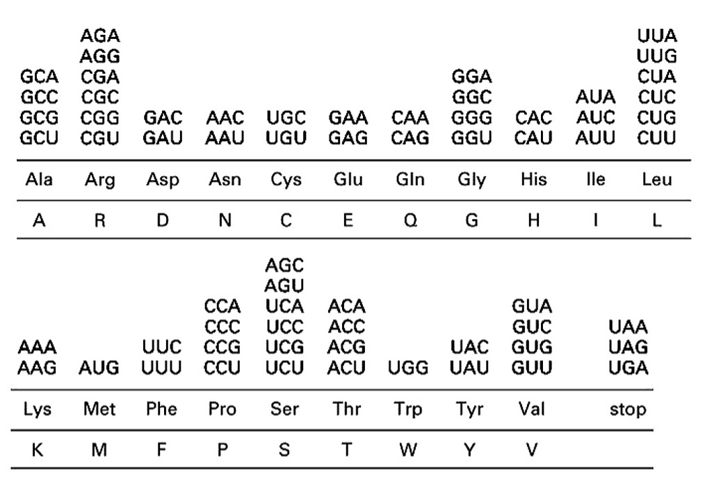

NAME(S):  

# Objectives

* To practice with conditionals and iteration (looping) 
* To get more practice writing functions, this time with return values 


# Reminders for Pair Programming

Pair programming guidelines:

* Roles: 
    +	driver: has the keyboard and types
    +	navigator: guides the driver

* Instructions:
    + You should be talking to each other constantly!
    + You should be able to swap roles at any moment.
    + Swap roles every 5 to 10 minutes.


# Part 1: Developing an Algorithm 

Write a function named codon2aa with the following definition line: 

```
def codon2aa(codon): 
```

This function will take a single codon (as a String) and convert it to its associated one-letter amino acid. Do not print this amino acid inside the function. Merely **return** it out of the function. Remember, the `return` statement sends the result of the function back to the line of the function call so that you can make use of it in another function. Assume codons will be DNA, not RNA. (I realize this doesn't make biological sense since amino acids are formed from RNA, but tools like BLAST show all output as DNA, and we'll want to use BLAST later in this project.) 

Consult Figure 1.9 of the Dummies book again to find all the translations. For the three stop codons, convert those into empty strings; that is, a string containing no characters. An empty string is represented as "" (two quotes right next to each other -- no space or anything else between them). 

After a while, this function will start getting tedious to write. Hopefully, this will confirm for you the value of functions. We have to write it once somewhere, but once done, we should never have to write it again. Modular programming means once we have the recipe just right, we can just use it over and over again without having to redo tedious tasks. 


Once written, test this function to be sure it works. Call the function in `main` a few times with test codons (like "CGG" or whatever) and then print what gets returned to be sure you get the right amino acid back ("R" in this case). 

* Related context question: Describe what type of molecule(s) facilitate translation -- how are nt codons used to determine aa sequence?

    ………………………………………………………………………………………………

    ………………………………………………………………………………………………

    ………………………………………………………………………………………………

    ………………………………………………………………………………………………

    ………………………………………………………………………………………………

    ………………………………………………………………………………………………


# Part 2: Using Loops

Write a Python function named `seq2protein` with the following definition line: 

```
def seq2protein(sequence): 
```

The parameter `sequence` is a nucleotide sequence (a String). This function will return the protein translation of the given sequence. To do this, you should repeatedly call the `codon2aa` method from Part 1 on each codon of the sequence. Write your algorithm in pseudocode before writing the code, and include this algorithm as comments in your Python file.  Use the limited English vocabulary worksheet just like before. You may also call other functions in your pseudocode.

The algorithm is up to you, but you are required to use a `for` loop once you translate your algorithm into code. You may find it helpful to reuse your `getCodon` function from Project 1 (if you alter it to return the codon instead of printing it), but that is not required. 

You should test this function in two ways. 

+ First, have the user input a 9-nt sequence. Convert the user's input into the associated protein and print it. 
+ Second, copy and paste in the long nt sequence for the gene you found in Part 3 of the last project, and run `seq2protein` on that. Go back to BLAST, and find the protein translation to confirm that your output is correct. Paste in the translation as comments in your code.


* Related context question: Does the same nt sequence always lead to the same protein? Why or why not?

    ………………………………………………………………………………………………

    ………………………………………………………………………………………………

    ………………………………………………………………………………………………
    
    ………………………………………………………………………………………………


Share your code between partners so you can each finish it outside of class if you need to. Individually submit to gradescope.

* Related context question: Alternate model for protein synthesis

You are investigating the process of protein synthesis on a new planet. You travel to the world and discover that the following tRNAs (and ONLY these) are used for the translation of mRNA encoding the following amino acids. There are 20 amino acids in total, the same as on Earth. As on Earth, G normally base-pairs with C, and A normally interacts with U in an anti-parallel manner. Only 5 amino acids and their corresponding tRNAs are shown here – the other 15 amino acids are omitted for clarity, but do indeed exist, and have their own set of corresponding tRNAs (also not shown here).  

| Amino Acid      | HIS | ILE | LYS | PHE | PRO |
|-----------------|-----|-----|-----|-----|-----|
| tRNA anti-codon | AUG | AAU | CUU | AAA | AGG |
|                 |     | CAU |     |     | CGG |
| No. of codons   | 2   | 3   | 2   | 2   | 4   |
|                 |     |     |     |     |     |


* Given this data, come up with the “rules” which are followed on this planet with respect to how the three nucleotides of the tRNA anticodons interact with the codons on the mRNA. You can assume the same genetic code (64 codons, AUG = Methionine, etc.) that is present on Earth also applies there, as does the overall mechanism of protein synthesis. 


    ………………………………………………………………………………………………

    ………………………………………………………………………………………………

    ………………………………………………………………………………………………

    ………………………………………………………………………………………………

    ………………………………………………………………………………………………

    ………………………………………………………………………………………………

    ………………………………………………………………………………………………


    

{width=400}
