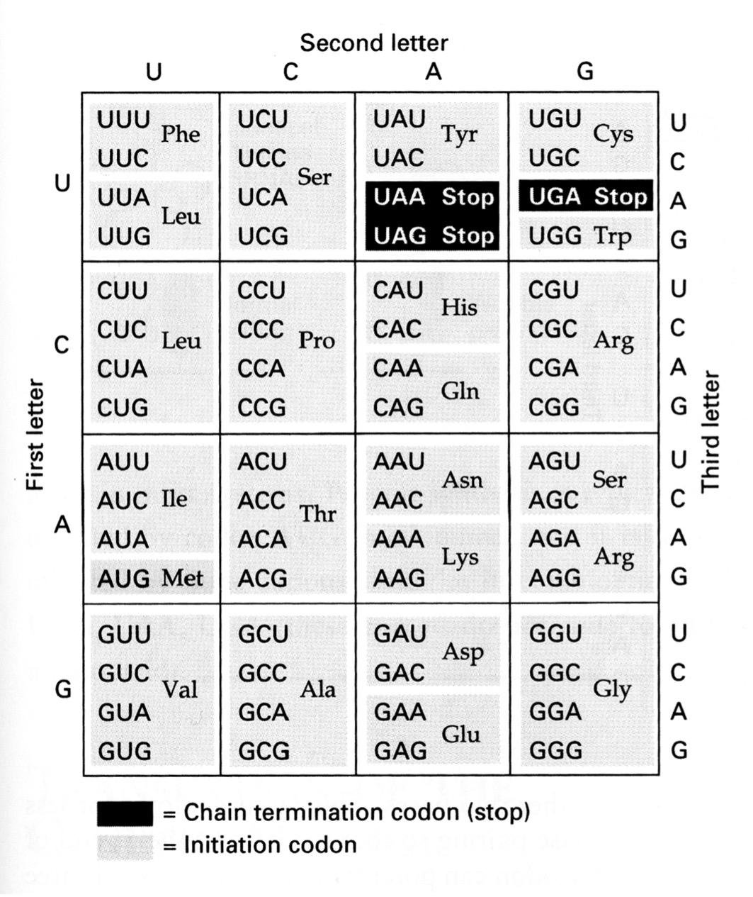

NAME(S):  

# ORF Finder

## Assignment Set-up

* start as an in-class activity, working in pairs
* finish independently as part of **HW 5, due 5/11/26**
* bring written answers to class for **0.5 engagement points**
* submit code on gradescope for corrections

## Objectives

* To practice with existing bioinformatic tools
* To experience the challenges interpreting sequence data
* To work in interdisciplinary pairs


## Introduction

An Open Reading Frame is a reading frame that contains no stop codons (or only one at the very end) and is often used in gene prediction.  If you have an ORF of sufficient length that starts off with ATG, that is evidence of a gene in that location.

You will build an ORF Finder tool, to understand a basic example, as well as familiarize yourself with the NCBI ORF Finder <https://www.ncbi.nlm.nih.gov/orffinder/> to see how real-life applications can get a little more complicated.

You have been given starter code (for building your own version of the tool) two text files containing the following DNA sequences (for using the NCBI version of the tool): 

* Document 1 (Gene X Genomic Seq.txt):  A genomic DNA sequence corresponding to "Gene X", and its' surrounding "flanking" sequences. This DNA has the entire gene X sequence, including both exons and introns, and the upstream and downstream regulatory elements (the Promoter and Terminator, respectively). 

* Document 2 (Gene X cDNA.txt): A cDNA sequence corresponding to the mRNA transcribed from Gene X.  This cDNA was "reverse transcribed" from mRNA, and therefore does not have any introns contained within the sequence. The upstream and downstream regulatory elements are also not represented in the cDNA.

## How to turn this in

Name your code "orf_finder.py" and report "orf_finder.pdf". Include comments indicating how each group member contributed. You may submit these together on Gradescope but bring your inidivudal written answers to class for 0.5 engagement points.

## Group work preparation

* after reading through the entire assignment, complete this section before any other

1. What knowledge and or skills will you need to complete this assignment?

\vspace{8em}

2. Do you know where can you gain those, independently, before beginning work? If so, what resources will you use?

\vspace{8em}

3. What will you be relying on from your partner(s)? What knowledge and or skills will your partner(s) need to complete this assignment?

\vspace{8em}

5. What resources (could be from the course website or from anywhere else) can you suggest they use to gain that knowledge and skills independently?

\vspace{8em}


6. What resources did they suggest for you?

\vspace{8em}

## Build Your Tool


```{python}
#| eval: false
# First, here's some familiar starter functions:

# returns codon number codNum from seq
def getCodon(seq,codNum):
    return seq[(codNum*3):(codNum*3+3)]

# returns last codon in sequence
def getLastCodon(seq):
    return seq[len(seq)-3:len(seq)]

# returns True if sequence is valid
# else returns False
def valid_seq(seq):
    for n in range(0,len(seq)):
        if valid_nt(seq[n])==False:
            return False
    return True
    
# returns True if given nucleotide is
# valid, else returns False.
# nt is valid if it's A, T, C, G, or U
def valid_nt(nt):
    if nt=="A" or nt=="T" or\
       nt=="C" or nt=="G" or\
       nt=="U":
        return True
    else:
        return False
```


1. Write the following two functions. They should neither print anything nor should they access substrings directly (no [ or ] in your code). Instead call other functions and use their return values.  Test and print in main() to make sure they work.

```{python}
#| eval: false
# returns True if given seq
# starts with "ATG".  Else, returns
# False
def beginsWithStartCodon(seq):
```


```{python}
#| eval: false
# returns True if given seq
# ends with a stop codon (TAG, TAA, or TGA).
# Else, returns False.
# Using other functions will make this
# function a LOT easier to write than
# your previous pseudocode and/or code!
def endsWithStopCodon(sequence):
```

2. All codons in an ORF must be in the same reading frame.  For example, in "CCGTATA" CCG and ATA are not in the same frame. We can guarantee that we have a single reading frame with no "leftover" nts by making sure the total number of nucleotides is divisible by 3. 

How do we do that? With a new operator.  We already have `+, -, *, and /`.  The new one is `%`, which stands for *modulo*.  9`%`2 is read "nine mod two" and means the remainder you get after doing 9/2 in long division. Since 2 goes into 9 four times, (2*4 = 8) it leaves a remainder of 1.  So 9%2 equals 1.

This gives an easy way of finding divisibility. If x%4 leaves no remainder, then you know x is divisible by 4.  Example: if x is 20, 20%4 equals 0, so you know 4 goes into 20 evenly.

To practice mod, write and test the following:

```{python}
#| eval: false
# Returns the string "EVEN" if num is an even number
# and "ODD" if it's odd. All even numbers are
# divisible by 2.  All odd numbers are not.
def isEven(num):
```


3. ORF checking. You're now ready to take a sequence and determine if it's an ORF or not. Write the following. Again, using substrings is disallowed. Use your other functions to make this easy.

```{python}
#| eval: false
# given some candidate sequence of nts,
# returns True if candidate is an ORF
# and False if it's not. A candidate is
# an ORF if all of the following are true:
# 1) it's a valid sequence (every nt is legal)
# 2) starts with the start codon
# 3) ends with a stop codon
# 4) length divisible by 3
#    (same reading frame)
# Test this one thoroughly!
def ORF_checker(candidate):
```


4. Almost there!  The real ORF finder doesn't just see if what you give it is an ORF or not.  It takes any old nt sequence and finds ORFs *within* it. So if you give it "CGACTAGTATGAGGTATGGACGGCCTTAACCC" ORF finder will find the 21-base ORF "ATGAGGTATGGACGGCCTTAA" starting at position 8 in the big string.  (The real ORF finder won't work on this small example because it's just that - too small. But you get the idea.)

To do this, we'll use the ORF_checker you just wrote to check EVERY POSSIBLE SUBSTRING in the big string. In other words, for the example above, we will check

```
C
CG
CGA
CGAC
CGACT
```
etc. to see if any of them are ORFs. That takes care of all sequences that start at position 0. Now we need to check all substrings starting at position 1:

```
G
GA
GAC
GACT
GACTA
```

etc.  And then we need to check all substrings that start at position 2, and then 3, then 4, etc.

So we need two variables: one to keep track of our starting position and one to keep track of the ending position.  And we'll check every possible combination of starting and ending positions.  This is a job for a nested loop.

Here's the pseudocode for ORF_finder:

```
for every possible starting position
   for every possible ending position
       determine the substring that starts\
       and ends at the specified positions
       
       see if that substring is an ORF

       if so
          print its length and start position
          return the ORF

```

You're ready.  Write the function.  You may use any Python you like, including substrings. Call on other functions to make your job easier.


```{python}
#| eval: false
# returns the first ORF found in NTseq.
# If one is found, print its starting position
# and length before returning it.
# Returns "No ORF" if there are no ORFs in NTseq
def ORF_finder(NTseq):

```


5. When you test this, try it out on the big string I give you in the main function.  Then go to <http://www.ncbi.nlm.nih.gov/gorf/gorf.html> paste in the same sequence, erase the backslashes, and submit it with the "OrfFind" button.

The first ORF it finds should be the same ORF your function finds.  Congrats! You just built an actual bioinformatics tool!

```{python}
#| eval: false
def main():
    s = "AGCCTAAGGACCCCAGCCAGCGCCGGTCTAGAGAATTCGGCACGA\
GGCCTCCCTGTATAAGGCAGTGGTCGTAATATGCTTGTGATCGCTCTCTCA\
TCTCGAGGGTCTTCTGAAGCGGCTGGCGCTTTTCATGACACGCACCTCGCGG\
TAAGTTCACCTATCGCAGCATCGACCTGTAGAAGGAGTTCTCCATCGGGCAG\
GCTCTTGATAGTTTGCCCAGTCGCACCCCCTTATCCGATGCCAGTCAGCCCT\
TCTCAGGACTATATCTGCTCTGGAGGCGCGACAAGCCGCGGGATACTTCAAC\
GCAGATTACCACCTCCAGCTCCGCGCACCAGCGCATTCATCCAGCAACCCCG\
CGCGCAAGTTCAACCCACTCTCTGTTCCACGAGCCCTTATCCCAAGAAGATG\
GTCGACGTCAAGCGCCGAGAGAAGGATGCCTTTGCTTCGTCCACTCCTACGA\
ACGAGAAGTTCTGAGATTTTTTTCTGTGATTATCTAGTACGGTCATGCCATT\
GTATTTCTACATCAAAAAAAAAAAAAAAAAAAAA"

main()
```


## A longer investigation

6)  Now take it up a notch with a longer gene. Paste the entire provided cDNA sequence (including the first line starting with the ">" symbol) into the input box of the NCBI ORF Finder <https://www.ncbi.nlm.nih.gov/orffinder/> . Click on the "Submit" button. The output shows all possible ORFs (Open Reading Frames - putative proteins) of a minimal size determined from the input sequence in all 6 possible reading frames [3 forward (+), 3 reverse (-)]. Essentially, the program looks for start and stop codons in the same reading frame, and then shows them graphically on the screen.

7)  **Which ORF is the correct one?**  Usually, but not always, the longest (greatest number of amino acids) is the one to choose. It is important to test your likely candidate ORFs by comparing them (BLASTing) them to the protein database to see if any of them generate significant "hits". Putative proteins with very significant hits are likely to be "real". The longest ORF (ORF1) is at the top of the list – it is 1638 nt long, and corresponds to a predicted protein of 545 amino acids. This amino acid sequence is shown in a box at the left hand side of the screen. 

\vspace{1em}

………………………………………………………………………………………………

………………………………………………………………………………………………


8)  At this point, you should copy the entire amino acid sequence (including the comment line “>lc1|ORF1” into a new google document named "orf_finder_[Your Group Initials]" (be sure to share it with everyone in the group). This document will serve as your record of these analyses, including answers to highlighted questions. Each indicidual group member should fill out answers on these pages and, as a group, you should keep a parallell copy in your google document as your "final answers". The handwritten versions will verify every group member was following along and account for any mistakes/discrepencies (never underestimate the power of having multiple copies of notes, especially both analog and digital!)

9)  Compare your predicted protein (polypeptide) to the database using BLAST (<http://blast.ncbi.nlm.nih.gov/>). Click on the right hand box, "Protein BLAST".  Paste your predicted polypeptide from the Word document into the Enter Query Sequence box of BLAST, and don’t change the defaults. Click on the blue "BLAST" button at the bottom of the screen. 

10)  Once the search has been done, check out the Descriptions, Graphic Summary and Alignments. You should then see if any putative conserved domains are detected. If you see one (or more), great - you probably have a real protein. If you don't, don't worry! In the Graphic Alignments you will see a series of colored lines - these represent pairwise alignments between your Query sequence (the predicted polypeptide), and other proteins in the database. These "Hits" are ordered from most significant to least significant (Red to Black, respectively - although you will only see red hits on this screen). In the Descriptions, you will be listed the hits found in the database. One of the columns called "E value" corresponds to the probability that the query sequence (your protein) matches the retrieved database protein solely by chance.  Therefore, a low value (zero is best) is a "good" or significant hit. 

11) Viewing the output from the BLAST search, the first, most significant hit is the predicted product from the *S. commune* genome project (i.e. itself). It is NOT identical – different at 4 amino acids because of strain to strain variation within the same species. This is the same phenomenon that would occur if we compared individual people for a particular protein. **What is the Sequence ID (line just underneath “general substrate transporter”) of the SECOND most significant hit?**

\vspace{1em}

………………………………………………………………………………………………

………………………………………………………………………………………………


**What percentage of the amino acids between the two proteins are identical (“Identities”)?** Click on the "GenPept" link found next to the "Download" row for this protein. What organism does this protein sequence come from (after the name of the protein)? Click on the "FASTA" link - what is the last amino acid in this protein sequence? (Give the single letter code).

\vspace{1em}

………………………………………………………………………………………………

………………………………………………………………………………………………


**What organism does this protein sequence come from (after the name of the protein)?** Click on the "FASTA" link - what is the last amino acid in this protein sequence? (Give the single letter code).

\vspace{1em}

………………………………………………………………………………………………

………………………………………………………………………………………………


Click on the "FASTA" link - **what is the last amino acid in this protein sequence?** (Single letter code).

\vspace{1em}

………………………………………………………………………………………………

………………………………………………………………………………………………


## Examining Splicing

12)  At this point, we want to compare the cDNA and genomic sequences for gene X in order to determine the location and number of introns in the gene. Remember that genomic sequences will have both introns and exons, while cDNAs contain only exons. Go back to the BLAST site at NCBI in your web browser, click on the “Nucleotide BLAST” (Left hand side) button, and then click on the small "Align two or more sequences” box underneath the large “Enter Query Sequence” box. This will allow you to align two specified nucleic acid sequences (you are NOT searching the database this time). Copy and paste the entire Gene X genomic sequence (including the first line starting with ">") into the top box under "Query Sequence". Copy and paste the entire Gene X cDNA sequence (including the first line starting with ">") into the box under "Subject Sequence". Click on the "BLAST" button at the bottom of the window. Once the output appears, click on the “Back to Traditional Results Page” link near the top right hand corner of the output.

13)  The output will show you where the two sequences align, which should roughly (but definitely not exactly in all cases) correspond to the exons. Note where these 12 areas begin and end, and relate them to the genomic sequences in order to determine the approximate locations of the exon/intron and intron/exon splice junctions. Print out this output, as this will make it much easier to determine the intron locations. Hint: Some, but not most (unfortunately) of the "non-aligned" regions in the genomic DNA will begin with "GT" and end in "AG".  This is because ALL introns will begin with a "GT", and end with an "AG". However, because of how BLAST tries to maximize the score, the alignment will artifactually spill over into one or both of the border areas between exons and introns. The size of introns in this organism is usually around 45-60 nucleotides, but can occasionally be bigger or smaller than this. Don't worry initially that there are occasional discrepancies between the cDNA and genomic DNA in the aligned regions: they are derived from different individuals from the same species, and hence there are what biologists call polymorphisms between them. 

Hint: the two versions of the protein are the same length (545 amino acids).  Second Hint:  There are two exons (and introns )that are upstream of the third exon that contains the real start codon (AUG) for translation. The first exon is the start of the mRNA transcript - there is no intron "upstream" of the first exon. **In total, how many introns and how many exons are there present in the ORF found in the genomic version of Gene X?**


………………………………………………………………………………………………

………………………………………………………………………………………………


14)  The BLAST alignment shows you roughly where the exons of the genomic sequence match with the cDNA (which is all exons, spliced together).  I suggest that you number the 12 different alignments, from the most upstream (#1) to the most downstream (#12).  These numbers will NOT correspond to the Range numbers listed in the BLAST output. Use the small numbers of the genomic query sequence alongside the alignment to order them. Once you have them all ordered, use the BLAST alignment to identify where the intron/exon junctions are - remember that ALL introns start with GT, and end w/ AG. BLAST does not align things perfectly most of the time.  Ideally, after the aligned segment the intron would begin - however, most of the time, it is off by a few nucleotides on one side or the other. Once you have identified where you think the first intron is, copy the sequences into your google doc and paste together exon 1 and exon 2.  Proceed to find the second intron, and continue the process. Starting with exon #3 (which contains the start codon (in bold and colored green), you can check to see if your cutting and pasting job is correct by comparing (using BLAST 2seq – Protein BLASTp) the predicted ORF (using ORFinder in NCBI) derived from the "spliced" genomic DNA to the correct ORF derived from the cDNA. Include the predicted ORF and the alignment between the ORF from the provided cDNA and predicted ORF in your google doc as well (screenshot is OK). If they match, great, then proceed w/ getting the next exon.  If they don't, you must have guessed wrong as to where the spice sites were and you MUST go back until you get it right. Only then should you proceed with finding the next exon.  Continue until you have correctly spliced all 12 exons together. This will be very frustrating at times! It will also make you realize how difficult it is even for algorithms to correctly predict all splice sites! Once you've determined the corrrect junctions, include the genomic DNA sequence and show (color, bold text) the location of all of the exons and introns on the genomic DNA sequence. **Indicate the start and stop codons on the sequence.** Be sure to include what your indications mean (eg. are bold sequences introns or exons, what indicates start and stop, etc.)


………………………………………………………………………………………………

………………………………………………………………………………………………


15)  In order to verify that your intron locations are correct, add to your record the genomic sequence that has all of the introns removed. Indicate exons by alternating text color/style. Use the ORFFinder web site to look for Open Reading Frames. If all of your splicing has been done properly, you should find an ORF that is almost identical to that found in the cDNA. If not, you will have to go back and look more closely at where you have spliced out genomic DNA and find the mistake(s). Hint: there will be a few (less than 6) amino acid differences between the predicted polypeptides derived from the cDNA and the “Spliced” Genomic DNA sequence, because of the polymorphisms between different strains or individuals. **What are these amino acid changes? Indicate the position and residue in each sequence.** Show the predicted polypeptides from these two sequences, and the output of a BLAST alignment comparing the two. 


………………………………………………………………………………………………

………………………………………………………………………………………………

16)  Your final task is to determine the "consensus" sequences for the exon/intron and intron/exon splice junctions for this gene. Once you have determined the position of all of the splice junctions, you can use a web-based tool at WebLogo (<https://weblogo.threeplusone.com/examples.html>) to create a consensus sequence for both the beginning and end of an intron in this gene. For exon/intron junctions, click on the "Edit Logo" button next to the "Human Splice Sites, Exon-Intron (Donor)" sites line at the bottom of the page. Once in this window, look at the format of what is in this box by default. Use the identical format to what is in the box as a default, with exonic sequences in UPPER CASE, and intronic sequences in lower case. Each splice junction sequence must be preceded by a line starting with the ">" symbol. You should include 6 nucleotides of the intron, and 6 nucleotides of the adjacent exon. Include these sequqences and their labels in your document. You will then have to delete what is in box by default, and then paste your sequences found at the exon/intron junctions into the "Multiple Sequence Alignment" box. When you are ready, click on the "Create Logo" button. Save this image and include it in your assignment write-up. For intron/exon junctions, click on the "Edit Logo" button next to the "Human Splice Sites, Intron-Exon (Acceptor)" sites line at the bottom of the page, and follow the same procedure as described above. **What are the exon|intron  and intron|exon consensus sequences?** 


………………………………………………………………………………………………

………………………………………………………………………………………………


## Group work debrief: after finishing entire assignment, complete this section before last

1. In your opinion, what was the most helpful thing your partner(s) did?

\vspace{4em}

2. What do you think was the most helpful thing you did?

\vspace{4em}

2. What is one practice or group (pair) dynamic you want to be sure to bring to your upcoming graded group projects?

\vspace{8em}

 { width=350px }

