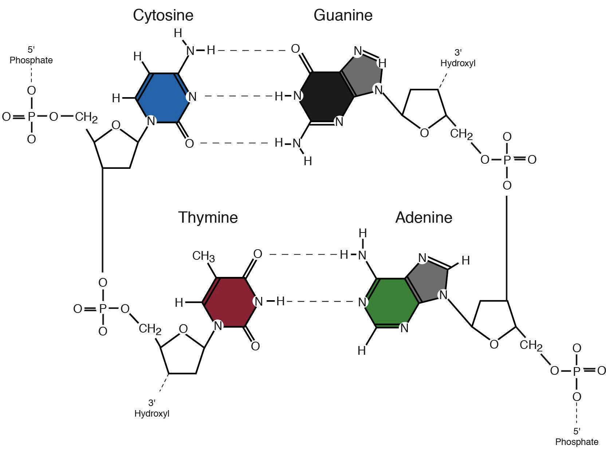
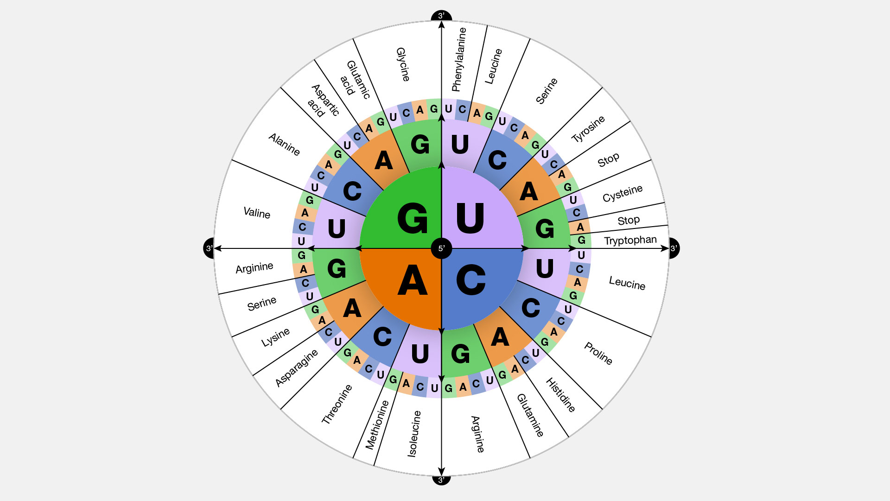
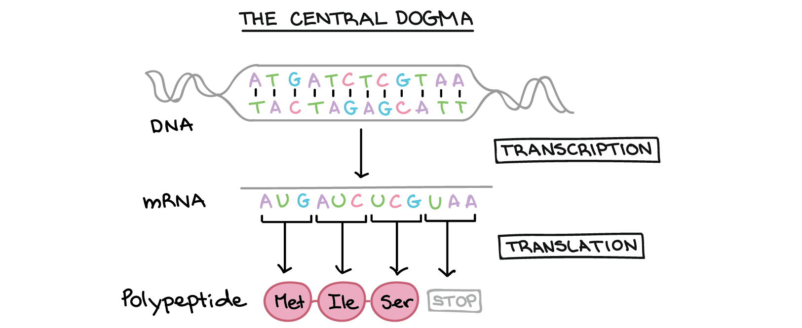
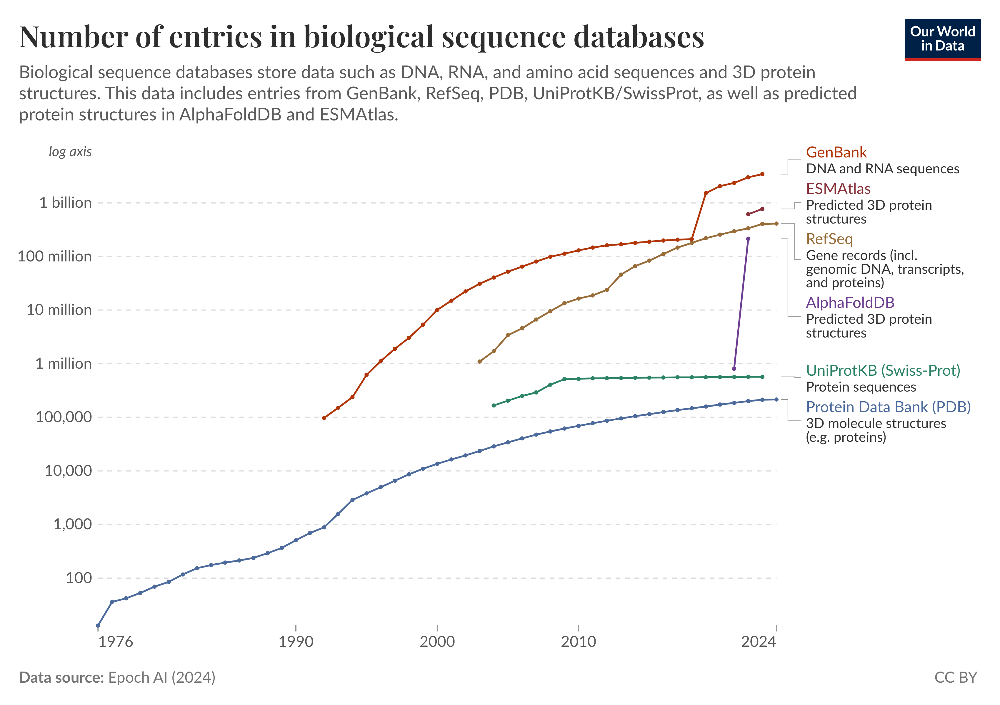
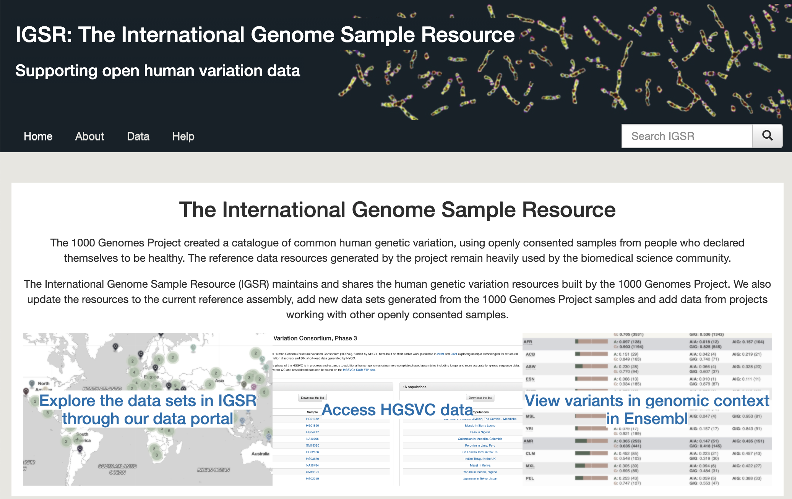
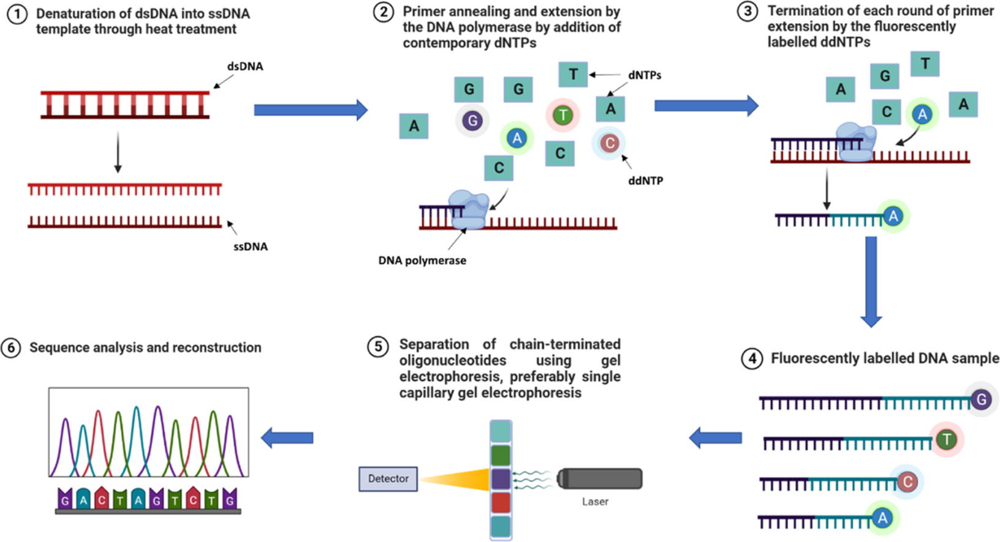
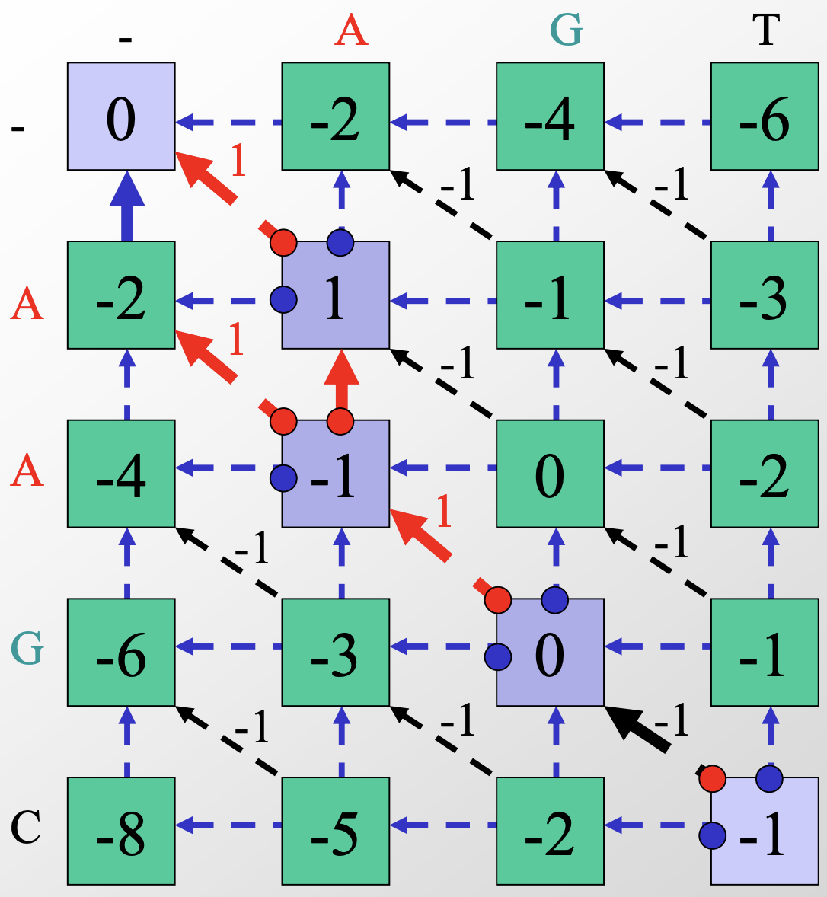
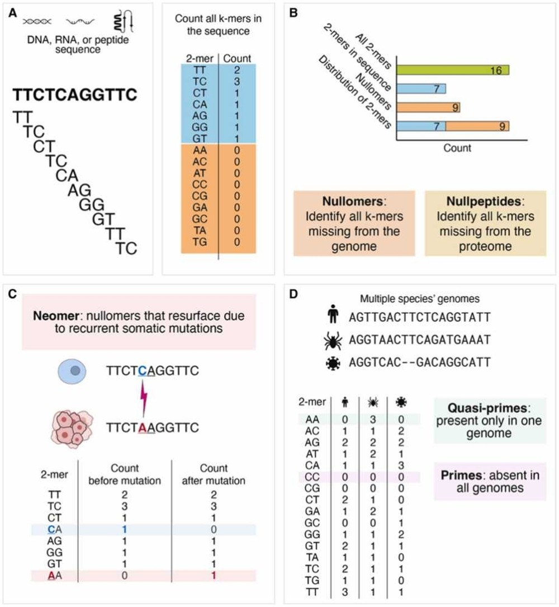
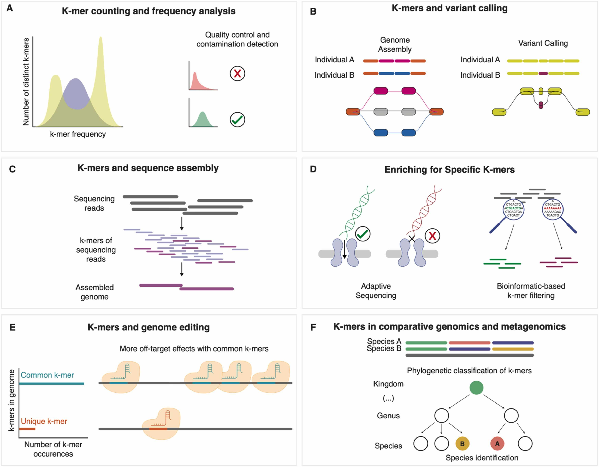
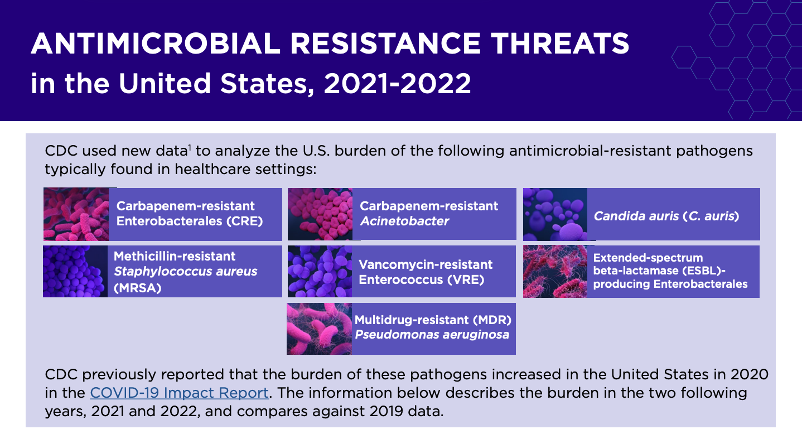

# CSC 483: Applied Biological Data Science


* Warm up:  (15')
* Sequencing data (30')
    + Gene seqeuence interpretation 
    + Gene content vs. expression
    + Analysis goals: gene function, use
* Activity: metadata summaries (45')
* Present results, brainstorm ideas (15')

* HW: 
	+ rosalind problems on sequence analysis (w/ colab notebooks?)
	+ pull request of e coli metadata analysis
	+ due: tues


# What is Biological Data?

```{mermaid}
flowchart LR
  A[DNA] --> |seqeunce| B(RNA)
  B --> |seqeunce| C(Protein)
  C --> |shape| D(Function)
```

# Rooted in Chemistry

{ width=500px }

# Ends up being about information

{ width=500px }

# What is a 'gene'

{ width=500px }

# Biological Data Accumulation

{ width=500px }


<https://ourworldindata.org/grapher/number-of-entries-in-biological-sequence-databases>

# Ethics of Data

* measured vs predicted data?
* references?
* funding sources?
* reproducibility?
* data types?
* cross population?
* intention of the data post? intention of the original data source?


# Purpose of Collecting Biological Data 

* for human data, studying health and disease, e.g. 1000s Genomes Project: <https://www.internationalgenome.org/>
	+ detect disease-associated alleles
	+ check specific loci, spots
	+ RNAseq - does it cause disease


	{ width=500px }

# Purpose of Collecting Biological Data  

* for non-human data (microbes, animals): who is there and what are they doing?
	+ whole genomes
	+ 16S, ITS
	+ meta-genomes
	+ RNAseq - what are they doing
	+ meta-transcriptomics


# Slides on gene expression and the environment


* always need comparisons
* treat cultures with drugs, etc.
* DNA: identifies subjects of interest
* RNA: describes activities


# Experimental Workflow

```{mermaid}
flowchart LR
  A[Collect Sample] --> B(Sequence DNA or RNA)
  B --> C(Align to Reference)
  C -->  D(Quantify) 
  D --> E(Interpret/Model/Hypothesis)
```

* as data scientists, we start right after sequencing
* we still need to know what was done during samples collection and sequencing
	+ "metadata"

# Course Goals

* Biological Data Science workflow from seq to data to hypothesis testing 
* Interdisciplinary scientific communication
* research projects


# DNA sequencing, a molecular approach


{ width=500px }

* dNTPs, gels (?)
* next generation machines, seqeuncing by synthesis, flouraphores

# Seqeunce interpretation

* fasta, nt sequence
* RBS
* codons, ORF, start/stop
* we can know genes are there without knowing what they do...

# Sequence interpretation by alignment

* reference sequences, databases
* BLASTP
* BWA align
* homology
* function prediction, alphafold

# Needleman-Wunsch Alg 

(Global Linear Kernel)

$$
S(i, j) = \max
\begin{cases}
      S(i-1, j-1) + s(x_i, y_j) & \text{(Match or Mismatch)} \\
      S(i-1, j) + g & \text{(Gap in } Y \text{)} \\
      S(i, j-1) + g & \text{(Gap in } X \text{)}
\end{cases}
$$

for example, where 

$$
g = -1
match = 1
mismatch = -2
$$


\begin{center}

$$
\begin{tabular}{|c|c|c|c|c|c|}
\hline
\textbf{ } & \textbf{ } & \textbf{G} & \textbf{A} & \textbf{T} & \textbf{T} \\
\hline
\textbf{ } & 0 & -2 & -4 & -6 & -8 \\
\hline
\textbf{G} & -2 & 1 & 0 & -2 & -4 \\
\hline
\textbf{A} & -4 & 0 & 2 & 2 & 0 \\
\hline
\textbf{T} & -6 & -2 & 2 & 3 & 4 \\
\hline
\textbf{T} & -8 & -4 & 0 & 4 & 4 \\
\hline
\end{tabular}
$$

\end{center}


# Demo filled

{ width=500px }



# Intructions for the Needleman-Wunsch Alg

Given a mismatch scoring scheme $s(x_i, y_j)$ where $x_i$ and $y_i$ are nucleotides and $g$ is a gap penalty, the optimal aligmnet score of two nucleotide sequences Seq1 and Seq2, indexed by $j$ and $i$ respectively, is :

$$
S(i, j) = \max
\begin{cases}
      S(i-1, j-1) + s(x_i, y_j) & \text{(Match or Mismatch)} \\
      S(i-1, j) + g & \text{(Gap in } Y \text{)} \\
      S(i, j-1) + g & \text{(Gap in } X \text{)}
\end{cases}
$$

for example, setting

$s(x_i, y_j) = \begin{cases}
      1 & \text{if Match} \\
      -1 & \text{if Mismatch} 
\end{cases}$

$g=-2$


Then, fill each square as:

$$
S(i, j) = \max
\begin{cases}
    \begin{cases}
      S(i-1, j-1) + 1 & \text{(Match)} \\
      S(i-1, j-1) - 1 & \text{(Mismatch)}
    \end{cases} \\
      S(i-1, j) - 2 & \text{(Gap in } Y \text{)} \\
      S(i, j-1) - 2 & \text{(Gap in } X \text{)}
\end{cases}
$$


1. Starting in the upper left corner, initiate with 0, then, moving across columns and down rows, fill in each square with:
    + the maximum value given the values at the previous indices
    + the previous indices from which the value builds (diagonal, left or up arrows)


\begin{center}

\begin{tabular}{|c|c|c|c|c|c|}
\hline
\textbf{ } & \textbf{ } & \textbf{ } & \textbf{A} & \textbf{G} & \textbf{T}  \\
\hline
\textbf{ } & &  $i=0$ & $i=1$ & $i=2$ & $i=3$ \\

\hline
\textbf{ } &  $j=0$ & 0 &   &   &   \\
\hline
\textbf{A} &  $j=1$ &   &   &   &    \\
\hline
\textbf{A} &  $j=2$ &   &   &   &    \\
\hline
\textbf{G} &  $j=3$ &   &   &   &    \\
\hline
\textbf{C} &  $j=4$ &   &   &   &  final score  \\
\hline
\end{tabular}

\end{center}

2. Once all squares are filled, **the bottom right corner has your best possible score**.


# K-mer based sequence representation

{ width=500px }


# K-mer based quantification


{ width=500px }

# RNA sequencing

* cDNA
* requires reference genomes
* espression levels
* count matrices
* does NOT require annotations


# Analyisis workflows/goals

* we want to know what cells/organisms use which genes for
* what are gene functions?
* when/where are genes expressed? why?
* are there cause/effect relationships we can interfere with or engineer?

# Project goals

* given dataset of E coli gene expression
* what questions can be asked/answered?
* how can metadata be explored? summarized?


# Lab machines: getting started

* Log on:
	* Your Union usernames
	* Default password: the word union followed by your ID number; e.g., union12345

**Always log off before leaving the lab**
 

# Setting up folders & google drive

* Create a folder for this course (e.g. names csc106).
* share it with me (doingg@union.edu)
* request a pro colab account using union email

* find e coli notebook

# Rosalind problems

* genes as strings
* accounts
* colab notebooks
* pair up?


# Ecoli metadata

* create colab notebook
* load E coli metadata
* plot a data characteristic accumulation over time
* how does it relate to 'world in data' graph?


## E coli background

{ width=500px }


* strains, genes
* pathogenicity
* CDC <https://www.cdc.gov/ecoli/about/index.html>
	+ click to "types"


## Activity

* explore metadata
* table
* plot
* revisit: what questions can be asked/answered?


## Finish activity: plotting metadata (1 pts)

1. Also in Colab, finish working with the metadata introduced in class.

2. Make at least 3 plots analyzing or summarizing columns.

3. Write down (in Markdown) a comparison you think would be interesting to make, why you think it would be interesting and what you hypothesize the result would look like.
	+ you don't have to succeed in your comparison yet, if you'd need more tools/libraries/functions to do so
	+ it is more important that you have a reason for making the comparion and an estimate to which you could compare your results


## HW: rosalind problems

* more python review
* examples of sequences processing/alignment
* at scale, libraries/packages/programs used for these steps
* colab notebook review: practice sharing, commenting, discussing, updating